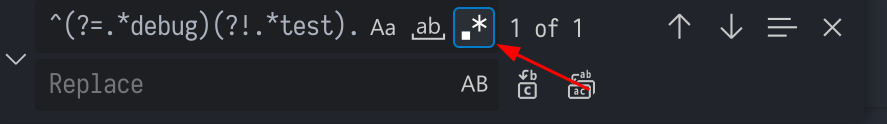

# vscode正则匹配



## 匹配xxx开头的行

语法：

```
^xxx.*\n
```

## 匹配xxx结尾的行

语法：

```
.*xxx$\n
```

## 匹配包含xxx的行

语法：

```
.*xxx.*\n
```

## 匹配不包含xxx的行

语法：

```
^(?!.*xxx).*\n
```

## 匹配包含xxx但不包含yyy的行

语法：

```
^(?=.*xxx)(?!.*yyy).*\n
```

## 匹配包含xxx或者yyy的行

语法：

```
^(?=.*xxx|.*yyy).*\n
```

## 匹配包含xxx且包含yyy的行

语法：

```
^(?=.*xxx)(?=.*yyy).*\n
```
